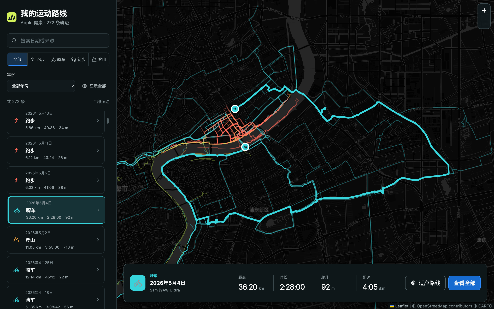

# Workout Route View

一个本地、只读的 Apple 健康户外运动轨迹查看器。项目使用 React、Vite 和 Leaflet 展示跑步、骑车、徒步及登山路线。

> 本仓库不提供示例数据。使用者需要自行从 Apple“健康”App 导出数据，在本机处理后加载。

## 项目截图



截图使用项目作者的真实路线数据；路线 JSON 不会随仓库发布。

## 功能

- 按运动类型、年份、日期或数据来源筛选轨迹
- 查看距离、时长、爬升和配速
- 高亮所选路线以及起点、终点
- 一键适应当前路线或查看全部路线
- 桌面端和移动端自适应布局
- Apple 健康数据只在本机解析

## 环境要求

- Node.js 20 或更高版本
- Python 3.10 或更高版本
- iPhone“健康”App 导出的 Apple 健康数据

## 一、导出 Apple 健康数据

Apple 官方导出步骤：

1. 在 iPhone 上打开“健康”App。
2. 进入“摘要”，轻点右上角头像或姓名首字母。
3. 轻点“导出所有健康数据”。
4. 等待导出完成，然后选择“存储到文件”、隔空投送或其他本地传输方式。

官方说明：[在 iPhone 上的“健康”中共享你的数据](https://support.apple.com/zh-cn/guide/iphone/iph5ede58c3d/ios)

导出文件包含完整健康记录和精确位置，属于高度敏感数据。不要把 ZIP、XML、GPX 或处理后的 JSON 放进 Git、公开网盘或聊天附件。

将导出的 ZIP 解压后，目录通常类似：

```text
apple_health_export/
  export.xml
  workout-routes/
    route_*.gpx
```

中文系统也可能生成 `导出.xml`。运行脚本时，应传入直接包含 `export.xml` 或 `导出.xml` 的目录。

## 二、安装项目

```bash
git clone https://github.com/SamXP2004/workoutRouteView.git
cd workoutRouteView
npm ci
```

## 三、处理健康数据

在项目目录执行：

```bash
npm run import-health -- "/绝对路径/apple_health_export"
```

脚本会：

1. 流式读取大型 `export.xml` 或 `导出.xml`，不把完整 XML 加载进内存。
2. 查找包含 `WorkoutRoute/FileReference` 的户外运动。
3. 读取对应 GPX，提取经纬度、海拔和轨迹时间。
4. 统一距离和能量单位，保留运动时间的原始时区。
5. 简化地图轨迹并估算累计爬升。
6. 生成本机文件 `public/data/routes.json`。

可选参数：

```bash
python3 scripts/import_apple_health.py \
  "/绝对路径/apple_health_export" \
  --output public/data/routes.json \
  --tolerance 0.00006
```

`routes.json` 包含精确坐标、运动日期、设备来源和运动元数据，已被 Git 忽略。

## 四、加载并查看

```bash
npm run dev
```

打开终端显示的 `http://127.0.0.1:5173/`。页面不会自动上传健康数据。

地图瓦片默认来自 CARTO，底层地图数据来自 OpenStreetMap。浏览地图时，瓦片服务仍可通过请求的瓦片区域、IP 和时间推断大致查看区域，但不会收到完整 GPX 文件。可以复制 `.env.example` 为 `.env.local`，配置自己的 Leaflet 瓦片服务：

```dotenv
VITE_TILE_URL=https://your-tile-provider.example/{z}/{x}/{y}.png
VITE_TILE_ATTRIBUTION=&copy; Your tile provider
VITE_TILE_SUBDOMAINS=
VITE_TILE_MAX_ZOOM=20
```

使用第三方瓦片服务前，请自行确认其许可、归属标注、流量限制和隐私政策。CARTO 对商业及非商业用途有单独的 [Basemaps 条款](https://docs.carto.com/faqs/carto-basemaps)；如默认服务不适用于你的场景，请通过环境变量更换瓦片服务。不要把包含 API Key 的 `.env.local` 提交到 Git。

## 编译与调试

| 命令 | 用途 |
| --- | --- |
| `npm run dev` | 启动仅监听 `127.0.0.1` 的开发服务器 |
| `npm run test` | 运行 JavaScript 和 Python 测试 |
| `npm run typecheck` | 执行 TypeScript/JSX 静态检查 |
| `npm run privacy-check` | 检查 Git 跟踪文件和构建产物是否含敏感轨迹 |
| `npm run check` | 依次运行测试、静态检查、安全构建和隐私检查 |
| `npm run build` | 安全生产构建，默认不复制 `public/` 私人数据 |
| `npm run build:private` | 将本机路线复制进 `dist`，仅供本人离线使用 |
| `npm run preview` | 预览最近一次生产构建 |

如果需要预览带有自己路线的编译结果：

```bash
npm run build:private
npm run preview
```

`build:private` 生成的 `dist/data/routes.json` 含精确位置。不要部署、上传、压缩分享或提交整个 `dist` 目录。

## 数据口径

- 分类来自 Apple Health 的 `workoutActivityType`。
- 距离、时长来自 Workout 记录；支持常见距离单位转换为 km。
- 爬升由 GPX 海拔点估算，不代表测绘级高程。
- GPX 坐标使用 Ramer-Douglas-Peucker 算法简化，默认容差约 6 米。
- 缺失或无法识别的数据保留为空，不填充为 0。

## 项目结构

```text
src/                         React + Leaflet 前端
scripts/import_apple_health.py  Apple 健康导入脚本
scripts/check_privacy.py        开源隐私检查
tests/                       JavaScript 与 Python 测试
public/data/README.md        本地数据目录说明
docs/                        项目截图与后续规划
```

## 后续规划

- [导入工具、运动指标与用户隔离规划](docs/IMPORT_AND_USER_ISOLATION_PLAN.md)

规划文档描述的是后续方向，不代表相关功能已经实现。当前版本没有账号、云端 API、数据库或多用户隔离。

## License

[MIT](LICENSE)
