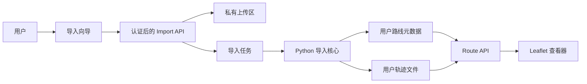

# 导入工具、运动指标与用户隔离规划

状态：Draft v2
日期：2026-07-22
适用项目：Workout Route View

## 1. 结论

下一阶段不应直接在当前静态页面上增加“登录”和“上传”按钮。当前应用只有 React/Vite 前端，固定读取 `/data/routes.json`，没有 API、数据库、认证或服务端授权，因此无法提供真正的用户隔离。

推荐按以下顺序推进：

1. 把现有 Python 导入脚本拆成可复用的导入核心，保留 CLI。
2. 在前端增加数据访问抽象，使地图不再依赖固定的 `routes.json`。
3. 实现导入向导和异步导入任务。
4. 引入服务端认证、租户数据模型和私有对象存储，完成真正的多用户隔离。
5. 最后补齐删除、导出、审计、限额和异常恢复。

“本机多个档案”只能提供界面层面的逻辑隔离，不是安全边界。只要目标包含多个真实用户或跨设备同步，就必须使用服务端认证和服务端授权。

## 2. 当前架构与限制

### 已确认的现状

- 前端是 React + Vite 静态应用。
- 前端使用 Leaflet 展示路线数据。
- `src/App.jsx` 固定请求 `/data/routes.json`。
- `scripts/import_apple_health.py` 从 Apple 健康导出目录读取 XML 和 GPX，直接生成单个 JSON 文件。
- 原始 GPX 轨迹点包含 `<ele>` 和 `<time>`，部分扩展字段还包含速度、方向及定位精度。
- 原始 XML 包含独立心率记录；部分 Workout 还包含平均、最低和最高心率统计。
- 当前 `routes.json` 已保留每个简化轨迹点的海拔和累计爬升 `ascentM`，但没有心率字段。
- 当前没有账号、会话、API、数据库、任务队列或对象存储。
- 路线数据包含精确坐标、日期、设备来源和运动元数据，属于敏感位置与健康数据。

### 当前方案不能解决的问题

- 无法判断一条路线属于哪个用户。
- 无法阻止用户 A 猜测路径并读取用户 B 的数据。
- 大型 Apple 健康导出只能通过命令行处理，缺少预检、进度、失败恢复和结果报告。
- 单个 `routes.json` 会随着路线增长而变大，无法按用户、年份或路线按需加载。
- 导入中断时没有 staging 和原子发布，可能留下半成品数据。

## 3. 产品目标

### 目标

- 用户通过向导导入 Apple 健康 ZIP 或解压目录。
- 导入前展示文件结构、大小、预计运动数量和隐私提示。
- 导入过程可查看进度、跳过原因和最终结果。
- 重复导入同一份数据不会产生重复路线。
- 导入失败不影响当前可用数据。
- 用户只能访问、删除和导出自己的导入任务与路线。
- 路线详情可展示平均、最低和最高心率，以及心率随运动时间的变化。
- 路线详情可展示海拔曲线、最低/最高海拔、累计爬升和累计下降。
- 心率、海拔和地图位置可以按运动进度联动查看。
- Leaflet 地图不感知数据来自本地文件还是 API。
- 默认不持久保存原始 Apple 健康导出包。

### 第一阶段不做

- Strava、Garmin 等第三方数据源。
- 社交、公开分享、排行榜和路线协作。
- 实时运动同步。
- 在线编辑或修正 GPX。
- 管理员直接查看用户原始坐标。

### 心率与海拔需求

#### 心率摘要

- 优先读取 Workout 内 `HKQuantityTypeIdentifierHeartRate` 的 `average`、`minimum` 和 `maximum`。
- 如果 Workout 没有统计值，但存在可关联的心率采样，允许由采样计算摘要，并标记数据来源为 `derived`。
- 列表页默认不加载完整心率曲线，只返回摘要和采样数量。
- 缺少心率时显示“无心率数据”，不能填充 0 或估算不存在的数据。

#### 心率曲线

- 从原始 XML 的 `HKQuantityTypeIdentifierHeartRate` Record 获取时间和 `count/min`。
- 先按 Workout 开始和结束时间匹配，再使用来源设备或 `sourceName` 辅助消除重叠运动歧义。
- 所有时间先按原始时区解析，再转成统一 UTC 存储；前端按用户时区显示。
- 曲线点使用 `elapsedSec` 与 Workout 对齐，不依赖数组下标。
- 允许为展示降采样，但必须保留原始样本数、降采样方法和摘要统计。

#### 海拔曲线

- 从 GPX `<trkpt><ele>` 读取海拔，并与轨迹点时间、累计距离对齐。
- 曲线点至少包含 `distanceM`、`elapsedSec` 和 `elevationM`。
- 地图轨迹简化与海拔曲线降采样必须分开处理，不能直接用简化后的地图点计算完整海拔统计。
- 输出最低海拔、最高海拔、累计爬升和累计下降。
- 海拔属于设备测量值，可能受 GPS、气压计和定位误差影响；产品中不得表述为测绘级高度。

#### 详情页交互

- 默认展示心率和海拔摘要；展开后加载曲线数据。
- 图表悬停或拖动时，同步显示时间、距离、心率、海拔和地图位置。
- 地图选中点时，图表定位到最近的时间或距离采样。
- 心率或海拔缺失时，另一项仍可独立显示。
- 移动端使用可横向拖动的单列图表，不要求同时展示两条完整曲线。

#### 建议数据结构

```json
{
  "heartRate": {
    "averageBpm": 136,
    "minimumBpm": 82,
    "maximumBpm": 183,
    "sampleCount": 1642,
    "source": "workout_statistics",
    "samples": [[0, 112], [5, 118]]
  },
  "elevation": {
    "minimumM": 3.1,
    "maximumM": 92.4,
    "ascentM": 118,
    "descentM": 115,
    "samples": [[0, 0, 3.1], [20, 8, 3.6]]
  }
}
```

心率样本格式为 `[elapsedSec, bpm]`；海拔样本格式为 `[distanceM, elapsedSec, elevationM]`。正式 schema 应使用字段说明明确数组顺序，并提供 schema version。

## 4. 推荐架构



### 4.1 导入核心

把 `scripts/import_apple_health.py` 拆成无 UI、无存储耦合的 Python 模块：

```text
importer/
  parser.py          # 流式读取 Workout 和心率 Record
  gpx.py             # GPX、海拔、时间、距离和轨迹简化
  metrics.py         # 心率关联、海拔曲线和统计
  fingerprint.py     # 去重指纹
  models.py          # 统一数据结构
  pipeline.py        # 预检、解析、校验、发布流程
  storage.py         # 存储接口，不绑定本地或云端
scripts/
  import_apple_health.py  # 保留为薄 CLI
```

CLI 与未来服务端 worker 调用同一套导入核心，避免出现两套数据口径。

### 4.2 数据访问层

前端增加 `RouteRepository` 接口，替换 `fetch('/data/routes.json')` 的硬编码：

```ts
interface RouteRepository {
  listRoutes(filters): Promise<RouteSummary[]>
  getRouteGeometry(routeId): Promise<RouteGeometry>
  getRouteMetrics(routeId): Promise<RouteMetrics>
  getImportStatus(importId): Promise<ImportStatus>
}
```

实现两个 provider：

- `LocalJsonRouteRepository`：兼容当前本地 `routes.json`。
- `ApiRouteRepository`：面向认证后的多用户 API。

Leaflet 和筛选组件只接收标准化路线数据，不直接处理用户、认证或存储细节。

### 4.3 服务端建议

由于现有解析逻辑是 Python，建议服务端先采用 Python API，并保持可替换：

- API：FastAPI。
- 导入任务：初期使用独立 worker；任务增加后再接队列。
- 本地开发：SQLite + 本地私有目录。
- 正式环境：PostgreSQL + 私有对象存储。
- 身份认证：由独立认证服务签发会话；具体供应商在部署方案确定后选择。

不建议把大型 Apple 健康 XML 完全放在浏览器内解析。导出文件可能很大，浏览器内存、后台任务和失败恢复能力都不稳定。

## 5. 导入流程

### 5.1 用户流程

1. 选择 Apple 健康 ZIP 或解压目录。
2. 展示隐私说明、文件大小和上传范围。
3. 预检目录结构：确认 XML、GPX 数量、压缩包安全和大小限制。
4. 创建导入任务并上传到当前用户的私有 staging 区。
5. worker 流式解析 XML，提取包含路线引用的户外运动、Workout 心率摘要和心率 Record。
6. 解析并校验 GPX，计算轨迹、海拔曲线、爬升和下降。
7. 按时间窗口和设备来源将心率采样关联到 Workout，并记录匹配诊断。
8. 分别生成地图轨迹简化结果、心率曲线和海拔曲线。
9. 生成去重指纹并将结果写入 staging 数据集。
10. 全部完成后原子切换为可见数据；失败则保留旧数据。
11. 展示新增、重复、跳过、无效、缺少心率和失败数量。
12. 删除原始上传包，保留导入报告。

### 5.2 任务状态

```text
created -> uploading -> queued -> parsing -> validating -> publishing -> completed
                    \-> cancelled
                    \-> failed
```

状态变化必须由服务端控制，客户端不能直接把任务标记为 `completed`。

### 5.3 去重规则

每条路线生成稳定指纹，建议由以下字段组成：

- 运动类型。
- 开始时间。
- 原始 GPX 内容哈希或规范化坐标哈希。
- 距离和时长作为辅助字段。

数据库使用 `(user_id, fingerprint)` 唯一约束。同一用户重复导入不会新增路线，不同用户拥有相同公开路线也不会互相冲突。

## 6. 用户隔离设计

### 6.1 隔离原则

- `user_id` 只能从服务端验证后的会话获得，禁止客户端提交或覆盖。
- 所有路线、导入任务、文件对象和缓存键都必须包含租户维度。
- API 查询必须先限制 `user_id`，再按 `route_id` 或 `import_id` 查询。
- 对无权访问的对象返回 `404`，避免泄露对象是否存在。
- PostgreSQL 开启 Row Level Security 作为第二层防线。
- 对象存储必须是 private bucket，只通过短期签名 URL 访问。
- worker 消费任务时重新验证任务和 `user_id` 的绑定关系。
- 日志不得记录原始坐标、完整文件名、上传内容或签名 URL。
- 心率数据与精确位置数据使用相同的租户隔离、删除和审计规则，不能发送到产品分析或错误上报服务。

### 6.2 建议数据模型

```text
users
  id
  created_at

import_jobs
  id
  user_id
  status
  source_type
  source_size
  created_at
  completed_at
  error_code
  result_summary

routes
  id
  user_id
  import_job_id
  fingerprint
  activity_type
  started_at
  duration_min
  distance_km
  ascent_m
  descent_m
  elevation_min_m
  elevation_max_m
  heart_rate_avg_bpm
  heart_rate_min_bpm
  heart_rate_max_bpm
  heart_rate_sample_count
  bounds
  geometry_key
  metrics_key
  created_at

user_data_versions
  id
  user_id
  import_job_id
  status
  published_at
```

轨迹坐标不直接塞进路线列表响应。列表只返回摘要，选中路线后再按需读取 geometry，避免一次下载某个用户的全部坐标。

### 6.3 对象存储路径

```text
users/{user_id}/imports/{import_id}/source.zip
users/{user_id}/routes/{route_id}/geometry.json
users/{user_id}/routes/{route_id}/metrics.json
users/{user_id}/exports/{export_id}/routes.zip
```

路径前缀只是组织方式，不能代替授权检查。

### 6.4 本机多档案的边界

如果先做纯本机版本，可以用不同 profile 目录或 IndexedDB database 隔离数据，但必须在界面和文档中明确：

- 同一操作系统账号、同一浏览器 profile 下的用户不是安全隔离。
- 本地管理员、恶意扩展或能访问磁盘的人仍可能读取全部数据。
- 本机 profile 不能冒充云端账号体系，也不能作为后续服务端授权依据。

## 7. API 草案

```text
POST   /api/imports                    创建导入任务
POST   /api/imports/{id}/complete      通知上传完成并入队
GET    /api/imports/{id}               查询进度与结果
DELETE /api/imports/{id}               取消任务或删除导入结果

GET    /api/routes                     按年份、类型、分页查询摘要
GET    /api/routes/{id}                查询单条路线摘要
GET    /api/routes/{id}/geometry       查询单条轨迹
GET    /api/routes/{id}/metrics        查询心率与海拔曲线
DELETE /api/routes/{id}                删除单条路线

POST   /api/exports                    创建用户数据导出
DELETE /api/account/data               删除当前用户全部数据
```

所有接口都从服务端会话解析当前用户，不接受查询参数中的 `user_id`。

## 8. 安全与数据质量

### 上传安全

- 校验扩展名、MIME 和真实文件结构，不能只相信文件名。
- 防止 ZIP 路径穿越和压缩炸弹。
- 设置压缩前大小、解压后大小、文件数量和单个 GPX 点数上限。
- 禁用 XML 外部实体和网络实体解析。
- 限制解析时间、内存、并发任务数和用户配额。
- 原始上传包在成功、失败或超时后按策略删除，建议默认不超过 24 小时。

### 数据质量

- 记录缺少 GPX、无效 GPX、未知运动类型和异常坐标数量。
- 拒绝超出经纬度范围或少于两个有效点的路线。
- 对简化前后点数、边界和距离做一致性检查。
- 校验心率单位为 `count/min`，异常值只标记和报告，不能静默改写成正常值。
- 校验心率采样必须落在对应 Workout 时间窗口内；重叠 Workout 必须输出匹配诊断。
- 校验海拔值、时间和累计距离的顺序；缺失海拔时不能用 0 代替。
- 对海拔平滑、爬升阈值和曲线降采样使用固定版本算法，并在导入报告中记录版本。
- 导入报告只显示统计和可操作错误，不暴露服务端路径或堆栈。

## 9. 分阶段实施

### Phase 1：导入核心与数据契约

- 拆分 Python 导入核心，CLI 行为保持兼容。
- 定义 route summary、geometry、metrics 和 import report schema。
- 提取 Workout 心率摘要，并把独立心率 Record 按时间与设备来源关联到运动。
- 生成带 `distanceM`、`elapsedSec` 的海拔曲线和累计下降。
- 地图轨迹、心率曲线和海拔曲线分别简化或降采样。
- 增加正常、重复、缺失 GPX、恶意 ZIP、异常坐标测试样本。
- 增加无心率、心率摘要、完整心率曲线、重叠 Workout、时区跨日和缺失海拔测试样本。
- 增加确定性指纹和去重测试。

验收：同一输入通过 CLI 和模块 API 生成相同结果；心率和海拔统计可追溯到原始数据；失败不会覆盖现有 `routes.json`。

### Phase 2：本地导入向导

- 增加“导入 Apple 健康数据”入口。
- 实现选择文件、预检、进度、结果和重试界面。
- 路线详情增加心率与海拔摘要、按需加载曲线和地图联动。
- 使用本地 API/worker 处理，不把大 XML 放进 React 主线程。
- 保留现有命令行导入作为恢复路径。

验收：用户无需终端即可完成导入；刷新页面后仍能查看最后一次成功数据；中断导入不影响旧数据。

### Phase 3：认证与真正的多用户隔离

- 接入认证和服务端会话。
- 引入 PostgreSQL、RLS 和私有对象存储。
- 所有表、任务、缓存和对象路径增加 `user_id`。
- 增加跨用户越权自动化测试。

验收：用户 A 使用自己的 token 枚举用户 B 的 route、import、geometry 和 export 均返回 `404`；数据库 RLS 直接阻断跨租户查询。

### Phase 4：生命周期与运营能力

- 用户导出和全部删除。
- 原始上传自动清理、失败任务清理和孤儿对象清理。
- 任务配额、速率限制、审计事件和异常告警。
- 大数据量分页、按年分片和 geometry 按需加载。

验收：删除后数据库、对象存储、缓存和导出文件均无残留；管理员日志不包含原始路线坐标。

## 10. 必须通过的隔离测试

- 用户 A 无法读取、修改、删除用户 B 的路线。
- 用户 A 无法读取用户 B 的导入状态或错误报告。
- 用户 A 无法读取用户 B 的心率摘要、心率曲线或海拔曲线。
- 修改 URL、route ID、import ID 和对象 key 均不能越权。
- 签名 URL 过期后不可使用，且只能访问指定对象。
- 缓存命中不会把用户 B 的响应返回给用户 A。
- worker 重试不会把结果写入错误用户。
- 同一文件重复导入只产生一份路线。
- 导入失败和取消不会发布半成品数据。
- 删除账号后无法从 API、对象存储和缓存恢复路线。
- 缺少心率或海拔的路线不会生成伪造的 0 值曲线。
- 心率摘要与曲线样本计算结果一致，允许的误差范围必须在 schema 中定义。
- 地图、心率曲线和海拔曲线在相同 `elapsedSec` 上指向同一运动位置。

## 11. 实施前需要确认的产品决策

以下决策会影响 Phase 2 之后的技术选型，但不阻塞 Phase 1：

1. 产品最终是纯本机工具，还是需要在线账号和跨设备同步？
2. 是否允许把原始 Apple 健康 ZIP 上传到服务端？
3. 原始上传包的保留时间是立即删除、24 小时还是用户可配置？
4. 是否需要多个家庭成员在同一设备上切换账号？
5. 是否需要部署到现有 Cloudflare、VPS 或其他基础设施？
6. 是否允许用户分享单条路线；若允许，需要单独设计脱敏和撤销机制。

## 12. 推荐的下一步

下一次实现优先做 Phase 1，不先接认证供应商：

1. 建立 `importer/` 模块和脱敏测试夹具，覆盖心率、海拔、时区、缺失值和重叠 Workout。
2. 把当前 CLI 改为调用导入核心，确保现有 272 条路线导入结果不回退。
3. 扩展 WorkoutStatistics 解析，支持 `sum`、`average`、`minimum` 和 `maximum`。
4. 实现心率 Record 的流式读取、时间窗口关联、来源设备消歧和导入诊断。
5. 实现基于距离与时间的海拔 profile、累计爬升/下降及独立降采样。
6. 定义 route summary、geometry、metrics、import report JSON Schema 和 schema version。
7. 增加心率与海拔自动化测试，并用真实导出的脱敏小样做只读校验。
8. 在前端引入 `RouteRepository` 和 `getRouteMetrics`，保持当前本地数据可用。
9. 写一份 ADR，确认产品选择“纯本机”还是“在线多用户”。

以上九项属于下一步 Phase 1。完成后再进入导入向导和曲线 UI，避免把解析、存储和展示逻辑写死在页面组件里。
